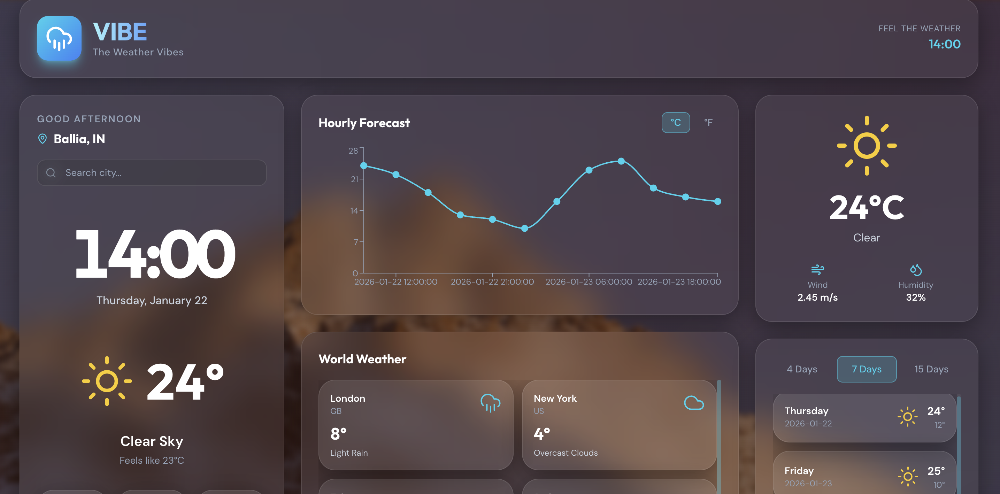

<h1 align="center">🌤️ VIBE — The Weather App</h1>

<p align="center">
  
  
  
  
  
  
</p>

<p align="center">
  
</p>

---

## ✨ About

**VIBE — The Weather App** is a futuristic, neon-styled weather dashboard that delivers real-time forecasts, hourly temperature charts, and dynamic day/night visuals — inspired by modern UI design.

---

## 🖼️ Preview

|  |

---


## 🚀 Features

- 🌍 Search weather by city  
- ⏱️ Real-time conditions  
- 📊 Hourly temperature graph  
- 🌤️ 5-day forecast  
- 🌙 Day & night dynamic UI  
- 📱 Fully responsive  
- ⚡ Fast and lightweight  

## 🛠 Tech Stack

<p align="center">
  
</p>
## 🛠️ Tech Stack

| Technology | Usage |
|-----------|--------|
| **HTML5** | Markup structure |
| **CSS3 / Tailwind** | Styling & layout |
| **JavaScript** | App logic |
| **React** | UI framework |
| **Recharts** | Graphs & charts |
| **Lucide Icons** | Icons |
| **OpenWeather API** | Weather data |


VIBE---The-Weather-App/
│
├── frontend/      # React UI
├── backend/       # (if used)
├── README.md
└── .gitignore

---

## 🚀 Run Locally

```bash
git clone https://github.com/adityaalpha16/VIBE---The-Weather-App.git
cd VIBE---The-Weather-App/frontend
npm install
npm start
```

Create `.env`:

```env
REACT_APP_OPENWEATHER_KEY=your_api_key_here
```

---

## 👨‍💻 Author

**Aditya**  
✨ Software Engineer | UI Enthusiast  

- 🐙 GitHub: https://github.com/adityaalpha16  

---

<p align="center">
  
</p>
